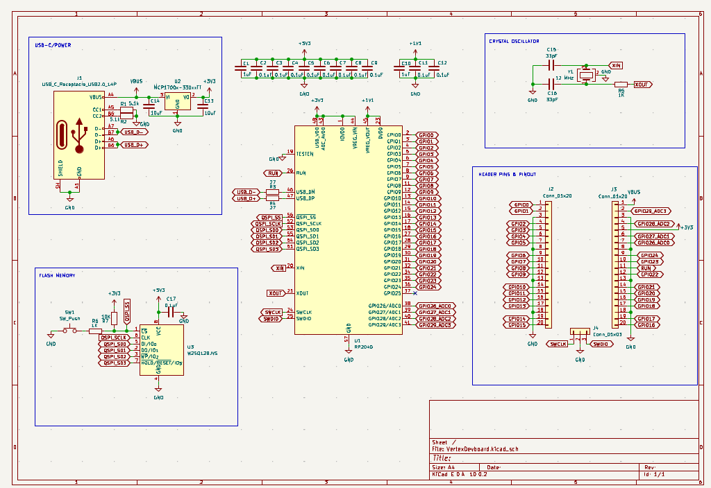
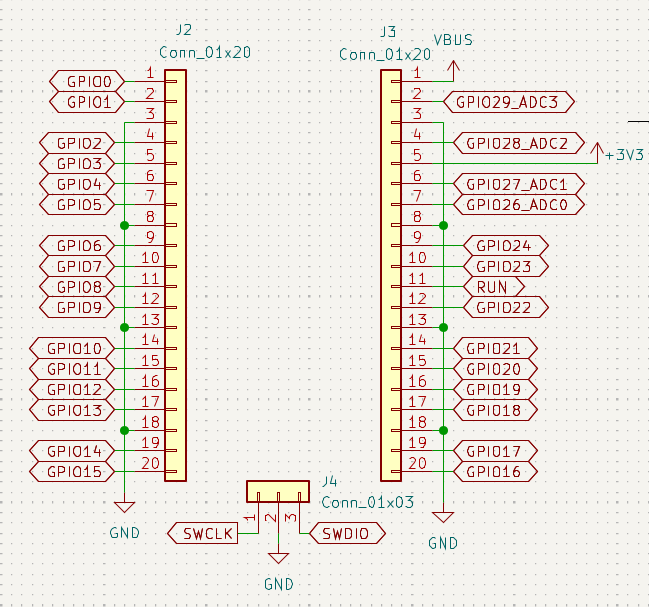
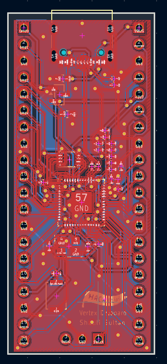
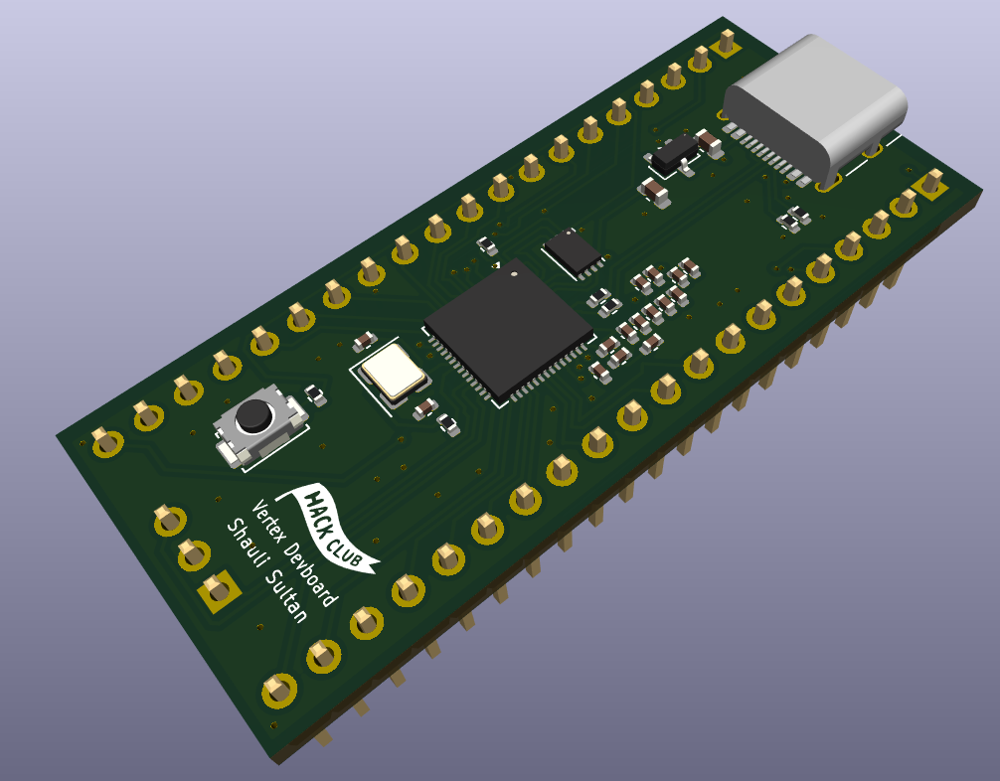

# Vertex Dev-board
A simple RP2040 based dev-board with:
- USB-C Connection
- Flash Memory
- Crystal Oscillator
- Boot Button

Schema:

The Pinout:

The PCB Design:

A 3D Render:

I've always wanted to understand how a devboard works
so i made one myself!
in the way i learnt:
- Why stable power is needed.
- how usb-c even works.
- How SPI & Quad-SPI works.
- What is a flash memory.
- Why do we need a clock(crystal oscillator).
- Why do we need a boot button.
- How to build a schema in kicad.
- How to build a pcb in kicad.
- What is a via.
- What is a copper filled zone.
- What is a diff pair.
- How to pass a DRC.
- How to fabricate.

It was a good journey and if i will have some time maybe i will work on a V2 with a RST Button, Wifi & BLE